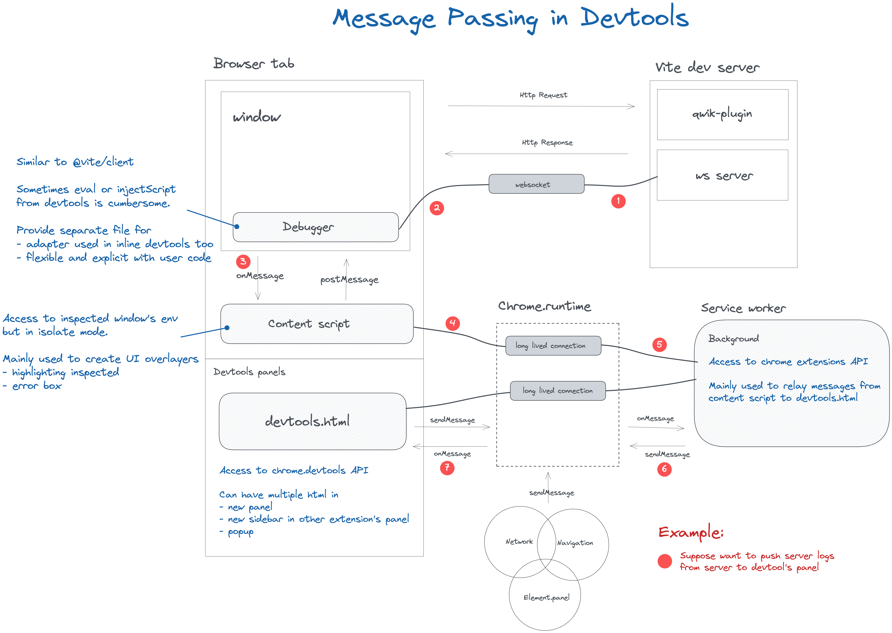

# Guide

## Chrome extension



Devtools extension is consist of three parts

- Devtools Page
- Content Script & Debugger
- Background

### Devtools Page

It is to create a devtool page, for now `devtools.html` is not rendered in anyway, it just import a script to access `chrome.devtools` like:

```javascript
chrome.devtools.panels.create('Qwik', 'assets/icons/32.png', 'index.html', (panel) => {});

chrome.devtools.panels.elements.createSidebarPane('Qwik', (sidebar) => {
  sidebar.setPage('sidebar.html');
});
```

`index.html` & `sidebar.html` in this example is bundled by vite, for more, check out `rollupOptions.input` in vite configuration file.

and get network headers

```javascript
chrome.devtools.network.getHAR((result) => {
  if (!result.entries.length) {
    Console.warn('Devtools suggests that you reload the page to track networks');
  }
  result.entries.forEach(handleHeaders);

  chrome.devtools.network.onRequestFinished.addListener(handleHeaders);
});
```

### Content scripts & Debugger

Both content scripts and Debugger can access document and windows or manipulating the DOM to create debug overlayers interface

but there're some differences

1. content scripts is execute in [isolated environment](https://developer.chrome.com/docs/extensions/mv3/content_scripts/#isolated_world)
2. content scripts have chrome.runtime api to exchange messages with background scripts
3. in order to make devtools logics reusable in other shells (like in stackblitz or other REPL live code), we can make content script only responsible for message passing, and let debugger doing more heavy works.

mainly inspired by [solid-devtools/debugger](https://github.com/thetarnav/solid-devtools/tree/main/packages/debugger)

```javascript
import { debugEndpoint } from '@builder.io/qwik-debugger';

export const onGet = debugEndpoint(() => {
  return { body: 'stuff' };
});
```

or

```jsx
import { Debugger } from '@builder.io/qwik-debugger';

export default component$(() => {
  return (
    <Debugger>
      {* stuff *}
    </Debugger>
  );
});
```

Ideas for discussion:

- [ ] how about move dev log utils like `printRenderStats` to debugger, and show these in performance panel ?
- [ ] how about put dev error handler or dev error box like `qerror` to debugger, then we have nice explanation and instruction to resolve it in logs panel ? not sure

### Background script

It have full access to [Chrome extension API](https://developer.chrome.com/docs/extensions/reference/), for example `onInstall` then use `Storage` to setup some persist data.

From my knowledge, not found something particular useful for devtools, exists mainly for message exchanges, relay messages from content script to devtools page.

## Inspect

First, an excuse of being lazy not implement vDOM view from scratch for now
- there are a lot of common UX on element panel and vDOM view
- sometimes need to switch back and forward to digging

And indeed, we definitely need to do it later
- can't collapse virtual component in chrome element panel
- support none chrome extension scenes

Listen to `chrome.devtools.panels.elements.onSelectionChanged` event, we can display the corresponding element info in Component's context.

there some kind of elements user might select

- lite component or component$
- children node of lite or component$
- virtual node of component$ boundary

then the ways of inspecting internal props might be different.

I'm suggesting this common layout for those component

 ┌──────────────────────────────────┐
 │ search by name .....             │
 ├──────────────────────────────────┤
 │ MyComponentName     SourceLink   │
 │                     ──────────   │
 │                                  │
 │ Props                            │
 │    .....                         │
 │    .....                         │
 │                                  │
 │ Stores                           │
 │    .....                         │
 │    .....                         │
 │                                  │
 │──────────────────────────────────│
 │ ParentComponent     Reveal       │
 │                     ──────       │
 └──────────────────────────────────┘

so, the question is how to

- get props
- get store
- from an element, search for its parent


## Loggings

WIP

- is `printRenderStats` useful for qwik app developer ? and how to interpret it or how to present it
- put Performance Timing API result in here for every page request

## Misc

With [Console Utilities](https://developer.chrome.com/docs/devtools/console/utilities/#inspect-function) we can programmatically reveal element or function in panel:

- `inspect(myEl)` or `inspect($0)` to locate that target in element tree
- `inspect(myFunction)` to view the function in source window

By [VS Code platform url](https://code.visualstudio.com/docs/editor/command-line#_opening-vs-code-with-urls) we can provide a link to open source file in IDE

## References

https://developer.chrome.com/docs/extensions/mv3/manifest/
https://developer.chrome.com/docs/devtools/console/utilities/
